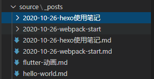

## hexo中插入图片

1. 安装hexo-asset-image

```bash
npm i hexo-asset-image -s
```

2. 更改_config.yml配置文件43行

```yml
post_asset_folder: true
```

3. 修改hxo-asset-image源码

文件目录

···bash
/node_modules/hexo-asset-image/index.js
···

参考链接 [插入图片](https://www.jianshu.com/p/f72aaad7b852)

注意更新后需要重启服务器

```js
'use strict';
var cheerio = require('cheerio');

// http://stackoverflow.com/questions/14480345/how-to-get-the-nth-occurrence-in-a-string
function getPosition(str, m, i) {
  return str.split(m, i).join(m).length;
}

var version = String(hexo.version).split('.');
hexo.extend.filter.register('after_post_render', function(data){
  var config = hexo.config;
  if(config.post_asset_folder){
        var link = data.permalink;
    if(version.length > 0 && Number(version[0]) == 3)
       var beginPos = getPosition(link, '/', 1) + 1;
    else
       var beginPos = getPosition(link, '/', 3) + 1;
    // In hexo 3.1.1, the permalink of "about" page is like ".../about/index.html".
    var endPos = link.lastIndexOf('/') + 1;
    link = link.substring(beginPos, endPos);

    var toprocess = ['excerpt', 'more', 'content'];
    for(var i = 0; i < toprocess.length; i++){
      var key = toprocess[i];
 
      var $ = cheerio.load(data[key], {
        ignoreWhitespace: false,
        xmlMode: false,
        lowerCaseTags: false,
        decodeEntities: false
      });

      $('img').each(function(){
        if ($(this).attr('src')){
            // For windows style path, we replace '\' to '/'.
            var src = $(this).attr('src').replace('\\', '/');
            if(!/http[s]*.*|\/\/.*/.test(src) &&
               !/^\s*\//.test(src)) {
              // For "about" page, the first part of "src" can't be removed.
              // In addition, to support multi-level local directory.
              var linkArray = link.split('/').filter(function(elem){
                return elem != '';
              });
              var srcArray = src.split('/').filter(function(elem){
                return elem != '' && elem != '.';
              });
              if(srcArray.length > 1)
                srcArray.shift();
              src = srcArray.join('/');
              $(this).attr('src', config.root + link + src);
              console.info&&console.info("update link as:-->"+config.root + link + src);
            }
        }else{
            console.info&&console.info("no src attr, skipped...");
            console.info&&console.info($(this));
        }
      });
      data[key] = $.html();
    }
  }
});
```

4. 使用

在以后创建项目时，只需要执行new命令

```bash
hexo new post webpack-start
```

就会自动生成一个放静态图片的资源文件夹



5. 发布

有时deploy上去的内容与本地不一样，可以先执行 clean清除缓存, 再deploy


