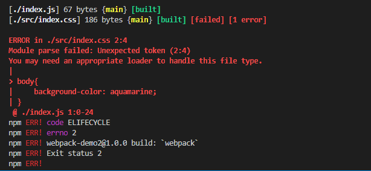

## loader是第三方模块

## loader的作用

webpack核心思想， 一切皆模块。要把一切都当作模块，则需要loader转化。

webpack只认识js文件，要打包css,图片文件。需要loader转换成webpack所认识的格式。

减少了依赖关系，工程管理依赖，不需要人工操作。

## 加载一个css文件

1. 创建文件

webpack-loader
  -src
    index.css
  index.js

  > index.js
  
  ```js
  import './src/index.css'
  document.write('<h1>webpack loader</h1>')
  ```

  index.css
  ```css
  body{
      background-color: aquamarine;
  }
  ```

> webpack.config.js

```js
module.exports = {
    mode: 'development',
    context: path.join(__dirname, './webpack-loader'),
    entry: './index.js',
    output: {
        filename: './main.js'
    },
    devServer: {
        publicPath: './dist'
    }
}
```

执行npm run build 发现报错，这是因为没有安装loader



2. 配置css-loader

loader都是第三方模块，先安装css-loader

```bash
npm i css-loader -D
```

webpack.config.js配置loader
```js
module.exports = {
    ...,
    module: { // 一切皆模块
        rules: [ // 数组表示不同模块，转换规则不一样
            {   // 对象才能更好描述如何配置
                test: /\.css$/, // 匹配到模块，才能使用该loader
                use: [ 'css-loader'] // 使用什么loader处理
            }
        ]
    }
}
```

在运行npm run dev, 发现打包成功但是效果没有显示。这是因为还需要使用style-loader.
css-loader和style-loader会一起使用。

3. 配置style-loader

安装style-loader

```bash
npm i style-loader -D
```

在webpack.config.js的use配置style-loader

```js
use:['style-loader', 'css-loader'] //先后顺序注意
```

配置是有先后顺序的，webpack使用多个loader时，会从后往前执行，内部用loader的链式调用。

先用css-loader转换， 然后使用style-loader。

即loader(styleLoader(cssLoader(index.css)))

## 其他配置属性

> include 和 exclude

> issuer 和 resource

