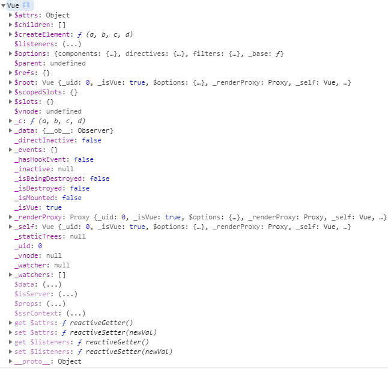
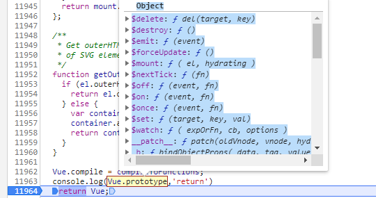

## 构建源码阅读环境

构建一个最简单的源码环境只需要一个vue.js文件即可。
工程化的vue源码项目会添加了很多其他东西，比如flow类型检测,个人觉得工程化是个很复杂的，会多了很多其他干扰。
我们的目标是读源码，所以只需要最简单的，纯粹源码文件即可。
工程只作为辅助作用，以后可以学习工程的设计思想，或者根据功能，单独的学习，比如工具类。

开始读源码，参考了一些资料。
比如工程搭建，就是看了参考一，当时内心就是这样😮。

- [参考一](https://github.com/qq281113270/vue)

- [参考二](http://hcysun.me/vue-design/zh/essence-of-comp.html)

计划就是，边看边补，不明白的地方就是需要补充的知识点。

所以读源码就要开始啦。

## hello word
先用npm下载vue包然后再dist目录下找到打包好的vue.js文件。


创建一个文件夹，文件夹内创建一个html文件，然后引入vue.js。

```js
<script src = "vue.js"></script>
```


第一步new 一个 Vue。

```js
var app = new Vue();
console.log(app);
```

可以看到一个vue对象下有很多属性


打开vue.js,可以看到这是一个立即执行函数.只看输入与输出，函数接收两个参数，
输出一个Vue对象。

两个参数，
global: this即window对象 
factory：自执行函数传入的一个函数，超级长的函数，几乎全部逻辑都在这个函数。从名字可以看出是一个工厂函数，所以需要使用关键字new创建一个vue对象。

第七行，判断是否使用es6-module引入vue.
第八行，判断是否amd引用方式。
第九行，判断是否用script方式引入vue,是则在Window对象下添加Vue属性，Vue等于factory()的返回值。


如果不使用关键字new,则会有一个报错。在633行和5077行。

633行调用的报错函数输出

我们去5077行看，
```js
  function Vue (options) {
    if (!(this instanceof Vue)
    ) {
      warn('Vue is a constructor and should be called with the `new` keyword');
    }
    this._init(options);
  }
```
可以看到Vue是个函数，判断this是否是Vue的实例，不是则报错，此时打印this是undefined,所以undefined._init()会报错。

执行流程就是在引入vue.js，就会执行立即执行函数，立即执行函数会在window对象下增加一个Vue属性。Vue的属性是一个函数。

```js
window: {
    Vue: function Vue (options) {
    if (!(this instanceof Vue)
    ) {
      warn('Vue is a constructor and should be called with the `new` keyword');
    }
    this._init(options);
  }
}
```

证明：
```js
console.log(window.Vue)
```

接着就是new一个Vue的事，new 出来的对象带的这么多属性是怎么加上去的呢？

我们可以在返回new对象之前打一个断点,可以看到Vue构造函数的prototype已经添加了很多的方法。



```js
$delete: ƒ del(target, key)
$destroy: ƒ ()
$emit: ƒ (event)
$forceUpdate: ƒ ()
$mount: ƒ ( el, hydrating )
$nextTick: ƒ (fn)
$off: ƒ (event, fn)
$on: ƒ (event, fn)
$once: ƒ (event, fn)
$set: ƒ (target, key, val)
$watch: ƒ ( expOrFn, cb, options )
__patch__: ƒ patch(oldVnode, vnode, hydrating, removeOnly)
_b: ƒ bindObjectProps( data, tag, value, asProp, isSync )
_d: ƒ bindDynamicKeys(baseObj, values)
_e: ƒ (text)
_f: ƒ resolveFilter(id)
_g: ƒ bindObjectListeners(data, value)
_i: ƒ looseIndexOf(arr, val)
_init: ƒ (options)
_k: ƒ checkKeyCodes( eventKeyCode, key, builtInKeyCode, eventKeyName, builtInKeyName )
_l: ƒ renderList( val, render )
_m: ƒ renderStatic( index, isInFor )
_n: ƒ toNumber(val)
_o: ƒ markOnce( tree, index, key )
_p: ƒ prependModifier(value, symbol)
_q: ƒ looseEqual(a, b)
_render: ƒ ()
_s: ƒ toString(val)
_t: ƒ renderSlot( name, fallback, props, bindObject )
_u: ƒ resolveScopedSlots( fns, // see flow/vnode res, // the following are added in 2.6 hasDynamicKeys, contentHashKey )
_update: ƒ (vnode, hydrating)
_v: ƒ createTextVNode(val)
$data: (...)
$isServer: (...)
$props: (...)
$ssrContext: (...)
constructor: ƒ Vue(options)
get $data: ƒ ()
set $data: ƒ ()
get $isServer: ƒ ()
get $props: ƒ ()
set $props: ƒ ()
get $ssrContext: ƒ ()
__proto__: Object
```

在new Vue的时候会执行_init方法。接下来看_init方法做了什么。

执行new Vue时，this = {}

4411 watcher

> 关于new一个对象。

new 一个对象需要构造函数，构造函数，顾名思义是个函数。


> 自执行函数做了什么事

1.返回Vue构造函数。构造函数的原型对象的方法和属性是什么时候加上去的。
答案是在执行自执行函数的时候。

```js
  initMixin(Vue);
  stateMixin(Vue);
  eventsMixin(Vue);
  lifecycleMixin(Vue);
  renderMixin(Vue);
```
> initMinx()

执行的第一个函数，设置了$options属性

> stateMixin();

分别设置了$data,$props属性，设置了$set, $delete, $watch方法.

$data和$props属性的set方法重写。提示了这两个属性都是只读。
get方法只分别返回 this._data, this._props。
```js
    dataDef.get = function () { return this._data };
    var propsDef = {};
    propsDef.get = function () { return this._props };
    {
      dataDef.set = function () {
        warn(
          'Avoid replacing instance root $data. ' +
          'Use nested data properties instead.',
          this
        );
      };
      propsDef.set = function () {
        warn("$props is readonly.", this);
      };
    }
    Object.defineProperty(Vue.prototype, '$data', dataDef);
    Object.defineProperty(Vue.prototype, '$props', propsDef);
```

> eventMixin
设置了$on,$once,$off,$emit方法

> 
设置了$forceUpdate , $destroy方法

> renderMixin

设置了$nextTick方法。
其中有个函数加了很多帮助方法。
```js
installRenderHelpers(Vue.prototype)
```
```js
  function installRenderHelpers (target) {
    target._o = markOnce;
    target._n = toNumber;
    target._s = toString;
    target._l = renderList;
    target._t = renderSlot;
    target._q = looseEqual;
    target._i = looseIndexOf;
    target._m = renderStatic;
    target._f = resolveFilter;
    target._k = checkKeyCodes;
    target._b = bindObjectProps;
    target._v = createTextVNode;
    target._e = createEmptyVNode;
    target._u = resolveScopedSlots;
    target._g = bindObjectListeners;
    target._d = bindDynamicKeys;
    target._p = prependModifier;
  }
```


